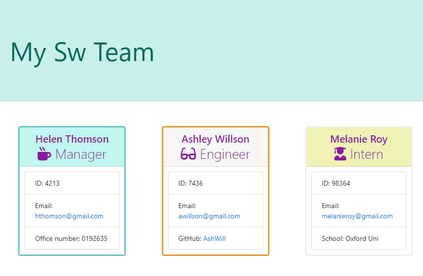

# GenerateSwTeam
Command-line application which takes in information about employees on a software engineering team, then generates an HTML webpage that displays summaries for each person
## Table of contents
  1. [Description](#description)
  2. [Installation](#installation)
  3. [Usage](#usage)  
  4. [Contributing](#contributing)
  5. [Tests](#tests)
  6. [Licence](#licence)

## Decription 
Convert the starter code provided, into a working Node.js command-line application. 
This application will take in information about employees on a software engineering team, then generates a HTML webpage that displays summaries for each person within the team.
Every part of the code is then tested and it should pass each provided test.

## Actions
- Create a node project by creating a new folder for the project and initialize it as an npm project with npm init -y;

- Install the older version of inquirer so that it doesnt break the setup using require(). 

- Modify package.json so that it uses jest to test.
        change scripts section to {
              "test": "jest --verbose test"
             }

- Add: node_modules in .gitignore file

- Create lib classes for the team members

- Run tests to make sure that the lib classes have been created correctly. 

## Installation

- Install the necessary dependencies by running the **npm i** command in Terminal
- Install the older version of inquirer so that it doesnt break the setup using require(). npm install --save inquirer
    Link to doc: https://www.npmjs.com/package/inquirer

## Usage

- This application is using npm inquirer package to collect user's input and Jest to run the unit tests. 
- When the user considers that they've got all of the team members added, they exit the application, and the HTML file is generated.

### Run the app
To initialize the app, run **node index** in Terminal

### Test
Use **npm run test** command to run the tests

## Output-file
Demo of the generated HTML file:

Add css styling

## Links

GitHub repository: https://github.com/Marilena-C/GenerateSwTeamPage

A sample HTML file generated using the application: https://github.com/Marilena-C/GenerateSwTeamPage/blob/main/output/team.html
